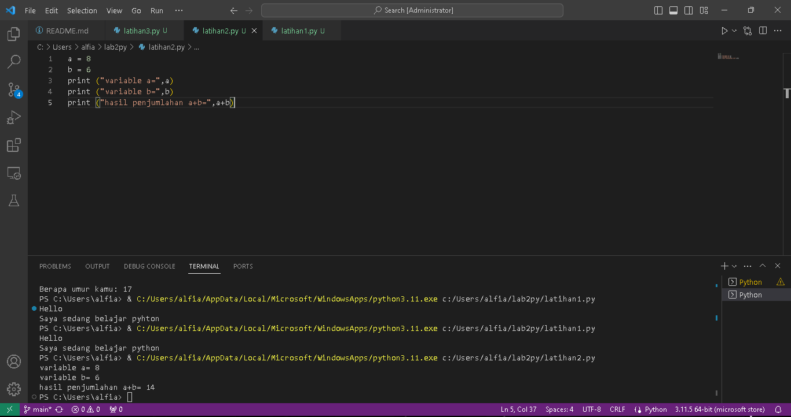
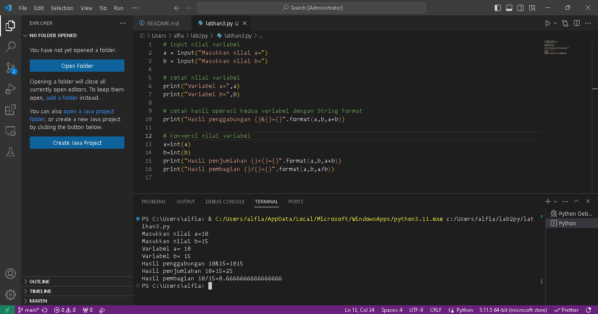

Latihan 1

<h>1. Menjalankan Python Di VScode</h>
 
A. Menampilkan tulisan "Hello" dilayar

 
B. Menampilkan tulisan"Sedang belajar python" dilayar 

 

Latihan 2

<h>2. Menjumlahkan dua buah bilangan menggunakan variabel a dan b.</h>

A. Mendefinisikan variable a dengan nilai 8

B. Mendefinisikan variable b dengan nilai 6

B. Mencetak nilai variable a dan b

D. Mencetak hasil penjumlahan a+b

Latihan 3

<h>3. Menjalankan IDLE</h>

A. Membuat file baru dengan nama latihan3.py (pastikan lokasi file
pada folder lab2py pada direktori kerja anda)

B. Menggunakan fungsi input untuk mengambil nilai variabel dari
keyboard
 

